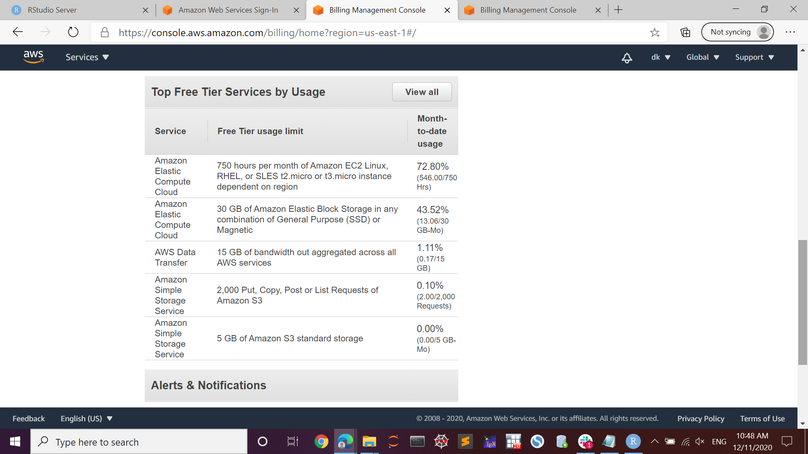

```{r load-packages, echo=FALSE, warning=FALSE, message=FALSE}
library(knitr)
```

It documents the use of RStudio installed on AWS (Amazon Web Services) during the final project period. It is comprised of 

- Project with AWS RStudio
- Installation Guidance
- References

## Project with AWS RStudio

The final project uses RStudio installed on AWS. Below is a screen of the RStudio instance on a web browser. 
```{r out.width = '100%'}

```

The R markdown file results in the document shown in the following.
```{r out.width = '100%'}

```

# Installation Guidance
It shows how to install Linux, R, RStudio, and Spark on AWS. If you want just RStudio, you can skip to "RStudio on Amazon EC2".

### Setting-up: Siging up for an account
Open the below website and follow the online instructions.

https://aws.amazon.com/free/?all-free-tier.sort-by=item.additionalFields.SortRank&all-free-tier.sort-order=asc)

- Information on credit card required 
- There are three different types of free offers

AWS provides usage information. Below is an example. It shows that the Free Tier usage limit is 750 hours per month for Amazon cloud computing and it used 72.8%, 546 hours.  

```{r out.width = '100%'}

```

### Creating an Amazon EC2 key pair (optional)

1. Open the Amazon EC2 console at https://console.aws.amazon.com/ec2/ 

2. On the lest sidebar, scroll down and choose **Key Pairs**

3. Choose **Create key pair**

- Choose .ppk if you use PuTTY

 
## Installing Amazon EC2 Linux

1. Open the Amazon EC2 console at https://console.aws.amazon.com/ec2/ 

2. From the console dashboard, scroll down and choose **Launch Instance**

3. From the page displayed, click **Select** Amazon Linux 2 AMI ... 
4. Choose **Review and Launch**

5. Choose **Launch**

6. When prompted for a key pair, select **Choose an existing key pair** and the key pair you created, and then choose **Launch Instances**

7. Scroll down and choose **View Instances**.

8. Done.  

## Connecting to the Linux instance (on a web brower)  

1. On the Amazon EC2 console at https://console.aws.amazon.com/ec2/, choose **Instances**

2. Click the instance ID number under the Instant ID column

2. Choose **Connect** 

3. Scroll down and choose **Connect** (You want to check the User name and IP address for connecting using PuTTY)

- You can have the Linux terminal on the web browser

```{r out.width = '100%'}

```

## Connecting to the instance (using PuTTY)  

1. Open PuTTY on your computer

2. In Host Name, put User name @ IP address (See above)

3. Choose + in SSH and then choose Auth

4. Choose Browse for key file (See Creating an Amazon EC2 key pair)

5. Choose Session and then put a name in Saved Sessions and then press Save

6. Choose Open, then a terminal will open.

- PuTTY download website is https://www.chiark.greenend.org.uk/~sgtatham/putty/latest.html

# RStudio on Amazon EC2
There are two ways of installing RStudio on AWS. The first one is simple:

1. On the following website https://www.louisaslett.com/RStudio_AMI/, choose an AMI nearby. 

2. Follow the online instructions or refer to https://towardsdatascience.com/how-to-run-rstudio-on-aws-in-under-3-minutes-for-free-65f8d0b6ccda

### Installing R and RStudio with Linux
R is available in Amazon Linux Extra topics "R3.4" and "R4"

To install R4, run

[ec2-user@ip-***-**-**-** ~]$ sudo amazon-linux-extras install R4

For RStudio, see https://jagg19.github.io/2019/08/aws-r/ 

### Installing Apache Spark
See the following websites

https://github.com/amplab/spark-ec2

https://sparkour.urizone.net/recipes/installing-ec2/

## References (websites)
https://docs.aws.amazon.com/AWSEC2/latest/UserGuide/concepts.html AWS's user guide for Linux instances

https://aws.amazon.com/amazon-linux-2/faqs/#Amazon_Linux_Extras Amazon Linux Extras library

https://github.com/amplab/spark-ec2 how to install spark-ec2

https://sparkour.urizone.net/recipes/installing-ec2/ installing AWS and Spark

https://jagg19.github.io/2019/08/aws-r/ An Up-to-date guide to running R on AWS EC2    

https://towardsdatascience.com/how-to-run-rstudio-on-aws-in-under-3-minutes-for-free-65f8d0b6ccda 3-minutes to run RStudio on AWS
